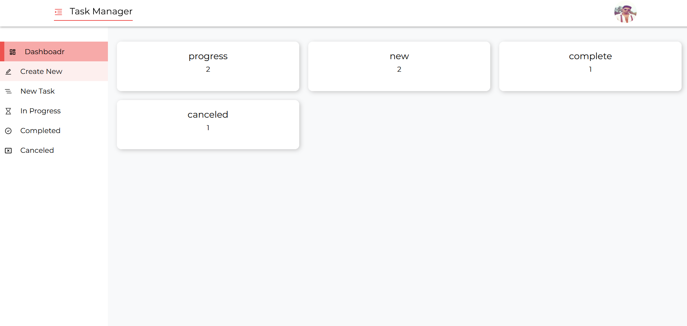

<h1>multi-user Task Manager.</h1>
<ul>
    <li>Install dependencies for back end</li>
</ul>

```
opne the "back-end" repository with VS Code
npm install
```
<ul>
    <li>Run  the back end</li>
</ul>

```
node index
```
<ul>
    <li>Install dependencies for front end</li>
</ul>

```
opne the "front-end" repository with VS Code
npm install
```
<ul>
    <li>Run  the front end</li>
</ul>

```
npm start
```

<h2>Live Preview:</h2>
https://taskmanager.abutorab.me
<br/><br/>


<h2>Features:</h2>
<p>Users can sign up for the system.Once registered, a user can log in to the system. If user forget his password, he can recover his password. password recovery will be done in three steps. At first 6 digit OTP code will be sent to the user's email. Then when user will provide the OTP code, it will be verified. After that password recover option will be given to the user.</p>
<p>After login user will see a dashboard which will contain the summary of all the tasks, for example how many tasks have been completed, how many have been canceled, how many are in progress and how many are new tasks.</p>
<p>
<p>From the "Create New" page user can create new task. User can see all new task on the "New Task" page. The tasks which are in progress can be seen on the "In Progress" page. Completed task can be seen on "Completed" page. And the tasks that have been canceled can be seen on the "Canceled" page.</p>
<p>The loading animation will be displayed if response from the server is delayed. </p>
<p>User can delete any task by clicking the delete icon from any page mentioned above. And the page will be reloaded after deleted.</p>
<p>User can also change the status (new, canceled, in progress, completed) of any task by clicking the edit icon from any page mentioned above.</p>
<p>User can view his profile. He can update profile information. He can also change the profile picture.</p>
<p>User can logout from the system.</p>




